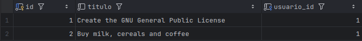
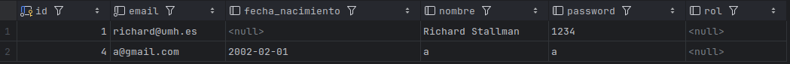
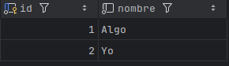

# Documentación Técnica - Ejercicio 3: To Do List New App
## Introducción

Este documento detalla las implementaciones realizadas para la versión 1.2.0 de la aplicación To Do List. Esta nueva versión incorpora una base de datos PostgreSQL, funcionalidades de integración continua con GitHub Actions y desarrollo guiado por pruebas (TDD) para nuevas funcionalidades de gestión de equipos.
Requisitos

Para ejecutar esta aplicación, necesitará tener instalado en su sistema:

    Java 8 SDK o superior
    Maven
    Docker (para la base de datos PostgreSQL)

### Repositorio y Docker

    Repositorio GitHub: https://github.com/Andres-Perez-Leonis/P3_ToDoListApp

### Construir y Ejecutar con Maven

Puedes ejecutar la aplicación directamente con Maven:

    ./mvn spring-boot:run

Una vez que la aplicación esté en ejecución, puedes acceder a ella desde tu navegador:

    http://localhost:8080/login

## Nuevas Funcionalidades Implementadas (Versión 1.2.0)
1. Integración Continua (CI) con GitHub Actions

La aplicación está configurada para utilizar GitHub Actions, asegurando que el código pase las pruebas automáticamente con cada pull request y en cada push a la rama main. Esto garantiza la calidad y estabilidad del código base.
Configuración de Tests en Pull Requests

Todos los Pull Requests deben pasar las pruebas de integración antes de poder ser fusionados con la rama main.
Archivo de Configuración de GitHub Actions

#### Developer Test
    name: Developer Tests
    
    on: push
    
    jobs:
        launch-tests:
            runs-on: ubuntu-latest
            container: openjdk:8-jdk-alpine
            steps:
                - uses: actions/checkout@v1
                - name: Clean build
                  run: ./mvnw clean
                - name: Launch tests with Maven
                  run: ./mvnw test

#### Integrations Test
    name: Integration tests
    
    on: push
    
    jobs:
        container-job:
            runs-on: ubuntu-latest
            container: openjdk:8-jdk-alpine
            services:
                postgres:
                    image: postgres:13
                    env:
                        POSTGRES_USER: atsd
                        POSTGRES_PASSWORD: atsd
                        POSTGRES_DB: atsd_test
                    options: >-
                        --health-cmd pg_isready
                        --health-interval 10s
                        --health-timeout 5s
                        --health-retries 5
                
                steps:
                  - uses: actions/checkout@v1
            
                  - name: Set up Maven wrapper permissions
                    run: chmod +x ./mvnw
                    
                  - name: Clean build
                    run: ./mvnw clean
            
                  - name: Launch tests with Maven
                    run: ./mvnw test -Dspring.profiles.active=postgres
                    env:
                      POSTGRES_HOST: postgres

2. Configuración para usar una Base de Datos PostgreSQL

La aplicación ahora soporta PostgreSQL como base de datos, lo que permite un entorno de desarrollo y producción más robusto. La configuración se maneja a través de perfiles de Spring Boot.
Archivos de Configuración de la Aplicación

Los archivos de configuración de Spring Boot (application.properties o application-*.properties) han sido actualizados para incluir las configuraciones específicas para PostgreSQL.

Ejemplo de configuración de PostgreSQL (application-postgres.properties):
#### application-postgres.properties
    spring.datasource.url=jdbc:postgresql://${POSTGRES_HOST:localhost}:${POSTGRES_PORT:5432}/atsd
    spring.datasource.username=${DB_USER:atsd}
    spring.datasource.password=${DB_PASSWD:atsd}
    spring.jpa.hibernate.ddl-auto=update
    spring.jpa.properties.hibernate.dialect=org.hibernate.dialect.PostgreSQL9Dialect
    spring.datasource.driver-class-name=org.postgresql.Driver

#### Pasos para la Ejecución con PostgreSQL

Ejecutar la base de datos PostgreSQL con Docker:

Para levantar una instancia de PostgreSQL en Docker (puerto 5432, usuario atsd, contraseña atsd, base de datos atsd):

    docker run -d -p 5432:5432 --name postgres-develop -e POSTGRES_USER=atsd -e POSTGRES_PASSWORD=atsd -e POSTGRES_DB=atsd postgres:13

Lanzar la aplicación con el perfil postgres:

    mvn spring-boot:run -Dspring-boot.run.profiles=postgres

Levantar la base de datos PostgreSQL para tests con Docker:

    docker run -d -p 5432:5432 --name postgres-test -e POSTGRES_USER=atsd -e POSTGRES_PASSWORD=atsd -e POSTGRES_DB=atsd_test postgres:13

Ejecutar los tests con el perfil postgres:

    mvn -Dspring.profiles.active=postgres test

4. Desarrollo Guiado por Tests (TDD)

Las nuevas funcionalidades de gestión de equipos han sido desarrolladas siguiendo la metodología TDD, asegurando un diseño robusto y un código de alta calidad.

### 008 Lista de Equipos. Esta funcionalidad permite a los usuarios ver un listado de todos los equipos registrados en la aplicación.

##### Método 'ListarEquipos' del controlador:

    @GetMapping
    public String listarEquipos(Model model) {
        model.addAttribute("equipos", equipoService.findAllOrdenadoPorNombre());
        return "listarEquipos";
    }

### 009 Gestión de Miembros de Equipo

Esta funcionalidad permite a los usuarios crear nuevos equipos y gestionar su propia membresía en los equipos (unirse o salir de ellos).

##### Método 'VerMiembros' del controlador:

    @GetMapping("/{id}")
    public String verMiembros(@PathVariable Long id, Model model) {

        List<UsuarioData> usuarios = equipoService.usuariosEquipo(id);
        model.addAttribute("usuarios", usuarios);

        Long idUsuario = managerUserSession.usuarioLogeado();
        // Recupera el usuario autenticado por su email
        UsuarioData usuario = usuarioService.findById(id);
        boolean yaEstaEnEquipo = usuarios.stream().anyMatch(u -> u.getId().equals(idUsuario));
        model.addAttribute("yaEstaEnEquipo", yaEstaEnEquipo);
        model.addAttribute("idEquipo", id);
        return "listarMiembros";
    }

### Construir Imagen Docker (Versión 1.2.0)

    docker build -t andresperezleonis/p2-todolistapp:1.2.0 .

### Obtener Imagen Docker (Versión 1.2.0)

    docker pull andresperezleonis/p2-todolistapp:1.2.0

### Ejecutar Contenedor Docker

    docker run --rm -p 8080:8080 andresperezleonis/p2-todolistapp:1.2.0

## Imagenes relevantes

